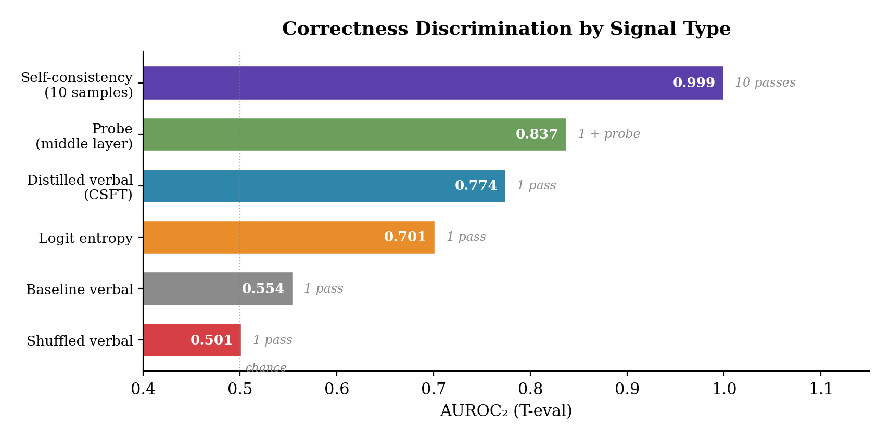
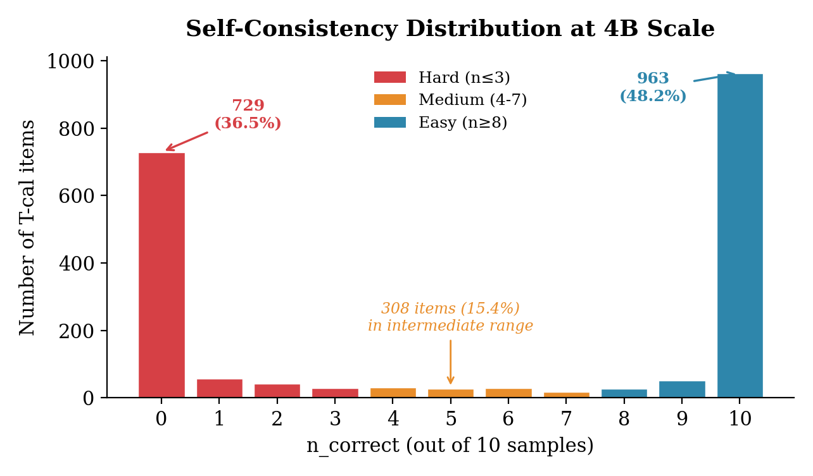
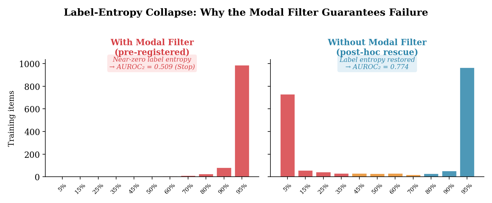

# metacog-engineering

Confidence-conditioned supervised fine-tuning (CSFT) with self-consistency targets for verbal metacognitive readout in small LLMs.

**Paper:** [Distilling Self-Consistency into Verbal Confidence: A Pre-Registered Negative Result and Post-Hoc Rescue on Gemma 3 4B](https://arxiv.org/abs/TODO)
**Pre-registration:** [OSF (osf.io/mpcr5)](https://osf.io/mpcr5)

## Overview

Instruct-tuned LLMs at the 3-9B scale produce degenerate verbal confidence: ceiling rates above 95%, near-chance Type-2 AUROC, and Invalid validity profiles under the CMM programme's psychometric assessment pipeline. Internal representations carry substantially more correctness information than the verbal channel transmits. This project investigates whether CSFT can close the gap.

The confidence targets are derived from 10-sample self-consistency at T = 0.7: the proportion of samples producing a correct answer is mapped to a confidence percentage. The model is then fine-tuned (LoRA) to output these confidence values alongside its answers. Evaluation uses Type-2 signal detection theory (AUROC2, VRS screening, paired-bootstrap CIs) with a shuffled-target control.

## Phase 0 Result (Gemma 3 4B-it)

**Pre-registered result (with modal filter): negative.** A modal filter restricting training to items with correct modal answers produced label-entropy collapse. AUROC2 dropped from 0.554 to 0.509. Decision tree: Stop.

**Post-hoc result (no modal filter): positive.** Removing the filter produced a binary verbal correctness discriminator.



The intervention compresses a 10-sample self-consistency signal (AUROC2 = 0.999) into a single-pass verbal readout (AUROC2 = 0.774), recovering ~77.5% of available discrimination at 1/10th the inference cost.

On MMLU (absent from training): accuracy improved from 54.2% to 77.4%, AUROC2 from 0.535 to 0.616. Shuffled-target control stayed at baseline (56.1%, 0.523), confirming the effect is target-dependent.

### Why the modal filter fails

The self-consistency distribution at 4B scale is strongly bimodal: 84.6% of items fall at n_correct = 0 or 10. The modal filter excludes all n_correct = 0 items, collapsing the training target distribution to near-uniform high confidence.





**Design principle:** Confidence training requires label entropy. Any filter that removes low-confidence examples collapses the target distribution and guarantees failure.

## Programme Structure

This is Phase 0 of a multi-phase programme:

- **Phase 0** (this study): Feasibility on Gemma 3 4B-it. Single model, single seed. Establishes the method and identifies design principles.
- **Phase 1** (planned): Scale replication on Gemma 3 12B-it and 27B-it. Tests whether binary confidence smooths to continuous, accuracy drop resolves, and MMLU improvement replicates with full controls.

## Repository Structure

```
metacog-engineering/
├── scripts/
│   ├── utils_phase0.py             # Data partitioning, disjointness filter
│   ├── step0_substrate_check.py    # Substrate pre-check (500 items)
│   ├── step1_baseline.py           # Baseline characterisation
│   ├── step1b_probe.py             # Linear probe on hidden states
│   ├── step2_calibration.py        # Self-consistency sampling (T=0.7)
│   ├── step2b_no_filter.py         # Target derivation (no modal filter)
│   ├── step3_finetune.py           # LoRA fine-tuning (real targets)
│   └── step4_evaluation.py         # Post-SFT evaluation
├── data/
│   ├── step0_substrate_check.json  # Step 0 pass/fail
│   ├── step2_summary.json          # Self-consistency distribution
│   ├── step2_conflict_set.json     # Items excluded by modal filter
│   └── step2_teval_difficulty.json # T-eval difficulty bins
├── results/
│   ├── baseline/                   # Baseline metrics and responses
│   ├── probe/                      # Probe AUROC2 across layer x position grid
│   ├── finetune/lora_real/         # LoRA adapter weights and config
│   └── evaluation/                 # Post-SFT evaluation and decision
├── figures/                        # Figures for README
├── metacog_env.ps1                 # Environment activation (Windows/ROCm)
└── .gitignore
```

## Data Partitioning

All items drawn from TriviaQA rc.nocontext validation (17,944 items) and MMLU. A programmatic disjointness filter excludes 524 items from a prior saturation study. The remaining 17,420 items are shuffled with seed 42 and sliced:

- **T-eval:** 1,000 items (held-out evaluation)
- **T-cal:** 2,000 items (calibration and training)
- **Step 0:** 500 items (substrate pre-check)
- **M-eval:** 498 MMLU items (cross-benchmark evaluation)

Pairwise disjointness is verified programmatically in `scripts/utils_phase0.py`.

## Hardware

Phase 0 ran on AMD Radeon RX 7900 GRE (gfx1100, 16GB VRAM) with ROCm PyTorch 2.8.0. Hardware-specific adaptations: bfloat16 (fp16 produces NaN on Gemma 3), eager attention (no SDPA for gfx1100), direct GPU placement (no accelerate device-map). These do not affect the analysis pipeline.

## Pre-registration

Phase 0 pre-registered on OSF: [osf.io/mpcr5](https://osf.io/mpcr5) (filed prior to baseline characterisation).

The pre-registered protocol with modal filter produced a confirmatory negative result (Stop). The positive result reported here is from a post-hoc no-filter modification and is exploratory. Phase 1 pre-registers the no-filter design as the confirmatory protocol.

## Related Work

This project is part of the CMM (Classical Minds, Modern Machines) research programme applying Type-2 signal detection theory to LLM metacognition. Related papers:

- Saturation of degenerate verbal confidence across seven frontier LLMs (Cacioli, 2026g)
- Model scale is dissociable from metacognitive monitoring quality (Cacioli, 2026c)
- Quantisation reshapes confidence distributions without improving metacognitive sensitivity (Cacioli, 2026e)
- Cross-entropy is load-bearing: bPC scope test (Cacioli, 2026l) — [github.com/synthiumjp/ima](https://github.com/synthiumjp/ima)

## Citation

```bibtex
@article{cacioli2026csft,
  title={Distilling Self-Consistency into Verbal Confidence: A Pre-Registered 
         Negative Result and Post-Hoc Rescue on {Gemma} 3 {4B}},
  author={Cacioli, Jon-Paul},
  year={2026},
  note={Preprint}
}
```

## License

Code: MIT. Data splits are deterministic from publicly available benchmarks (TriviaQA, MMLU). Model: Gemma 3 4B-it (Apache 2.0).
